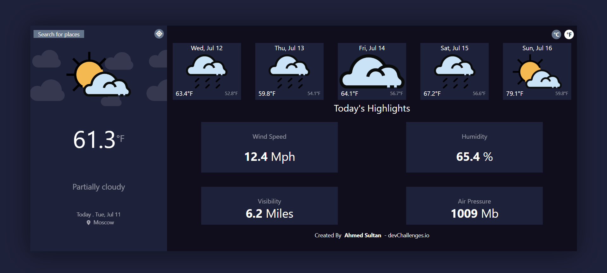

# React Weather App



Welcome to the React Weather App! This web application allows users to get the current weather information for a specific location and displays it on the screen.

## Features

- Display the current weather information for a given location.
- Automatically detects and displays the weather for the user's current location.
- Fetches weather data using the OpenWeatherMap API.
- Responsive design for optimal viewing on different devices.

## Technologies Used

- React: A JavaScript library for building user interfaces.
- HTML5: Markup language for structuring the web page.
- CSS3: Stylesheet language for styling the web page.
- Tailwind CSS: Utility-first CSS framework used for styling the components.
- OpenWeatherMap API: Used to fetch weather data for specific locations.

## How It Works

1. Enter Location: Users can enter a location in the search bar to get the current weather information for that location.

2. Current Location: By clicking the "Get Current Location" button, the app automatically detects the user's current location and displays the weather information for that location.

3. Weather Display: The app shows the current temperature, weather description, and other relevant weather details for the selected or current location.


## Installation

1. **Clone the Repository**

   ```bash
   git clone https://github.com/Ahmedsultan09/react-weather-app.git
   ```

2. **Install Dependencies**

   ```bash
   cd react-weather-app
   npm install
   ```

3. **Set API Key**

   - Sign up for an account at [OpenWeatherMap](https://openweathermap.org/) and get an API key.
   - Create a new file `.env` in the project root directory.
   - Add the following line to `.env` and replace `<API_KEY>` with your actual API key:

     ```bash
     REACT_APP_API_KEY=<API_KEY>
     ```

4. **Start the Development Server**

   ```bash
   npm start
   ```

5. **Open the App**

   Open your web browser and visit `http://localhost:3000` to access the React Weather App.
```

This markdown format provides a clear and concise explanation of the installation steps using bullet points. Make sure to replace `<API_KEY>` with your actual API key 
If you have any further questions or need additional assistance, please let me know!
